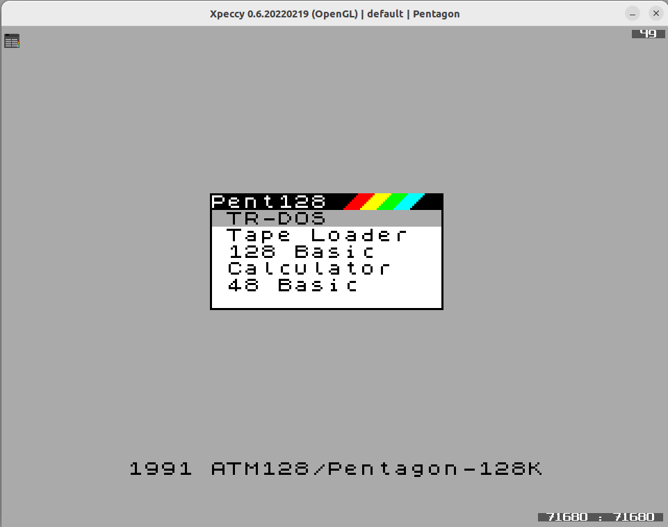
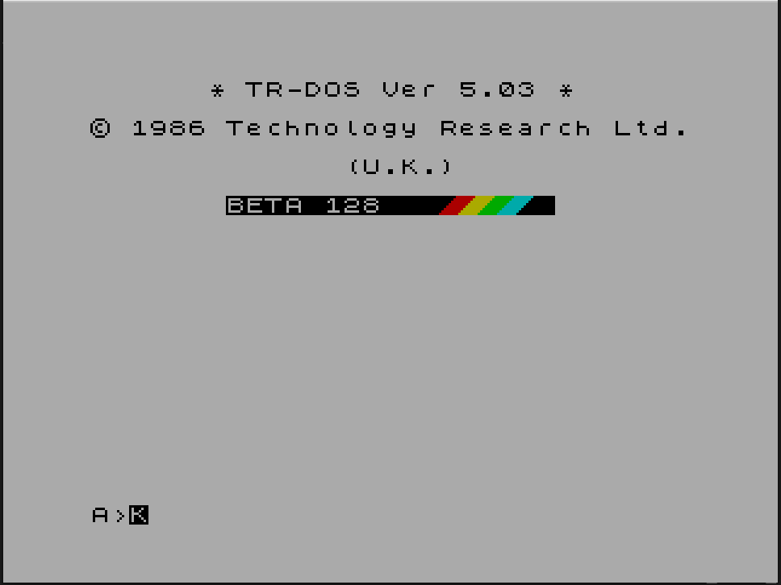
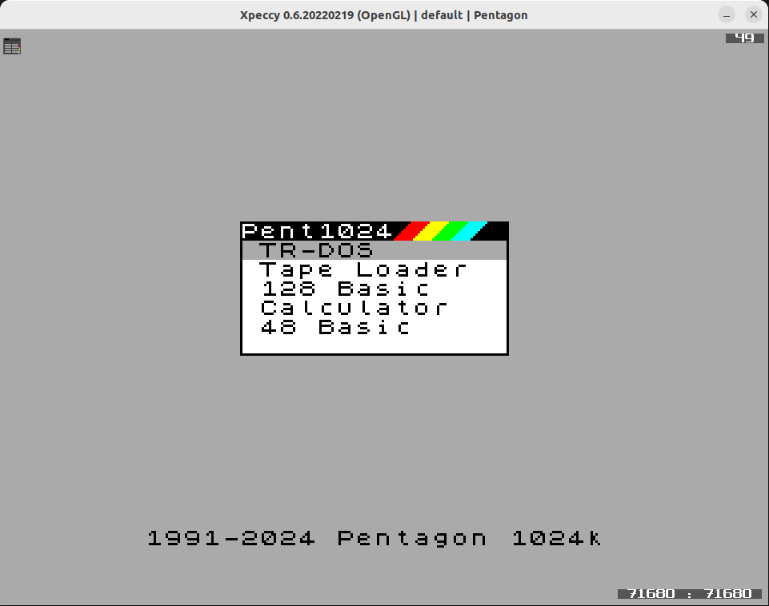
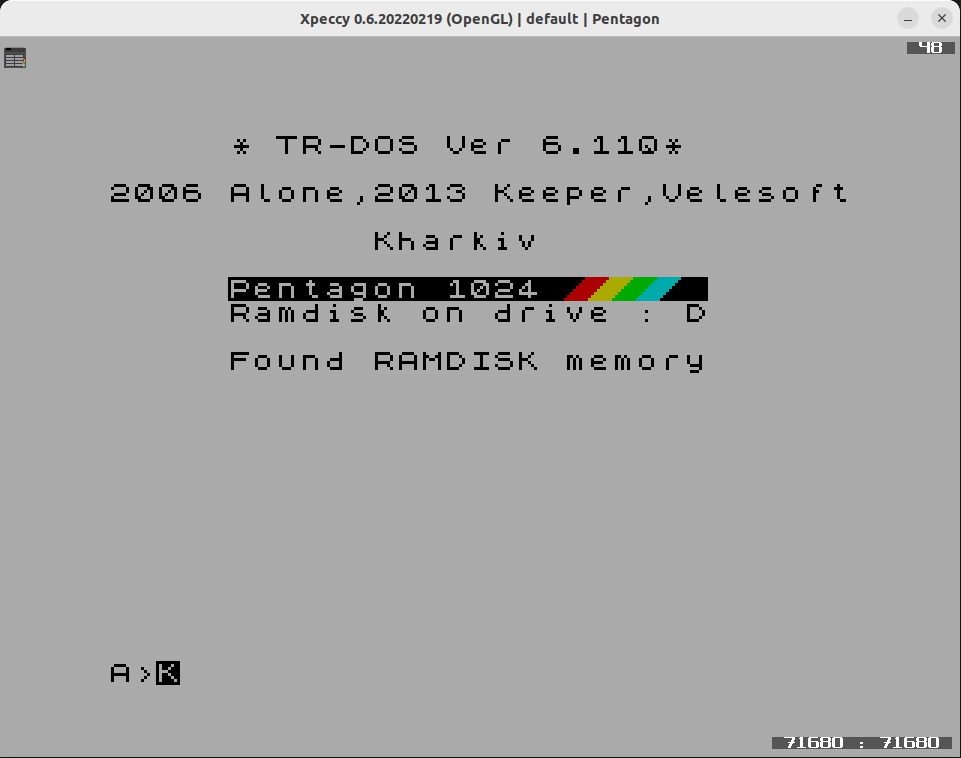

# Исправления прошивки ПЗУ для компьютера ATM128 известный как Пентагон-2 или Пентагон-128 и его модификации до 1024кб

Все скомпилированные файлы лежат в папке [build](build/)
- Для прошивки на реальный компьютер используется [amm_menu.rom](build/pent.rom)

## Предварительно скомпиллированные прошивки

- [Для Пентагон-128 подключенного через RGB](rom/pent128-trdos5.03-tv.rom)
- [Для Пентагон-128 подключенного через VGA](rom/pent128-trdos5.03-vga.rom)
- [Для Пентагон-1024 подключенного через RGB](rom/pent1024-trdos6.11q-tv.rom)
- [Для Пентагон-1024 подключенного через VGA](rom/pent1024-trdos6.11q-vga.rom)

## Фикс в Меню 128

## Фикс в TR-DOS 5.03

## Фикс в Меню 1024

## TR-DOS 6.11q (для 1024к)
- Включена автозапуск загрузки boot для эмуляторов
- Включен NMI
- Размер RAM-Диска 640кб

