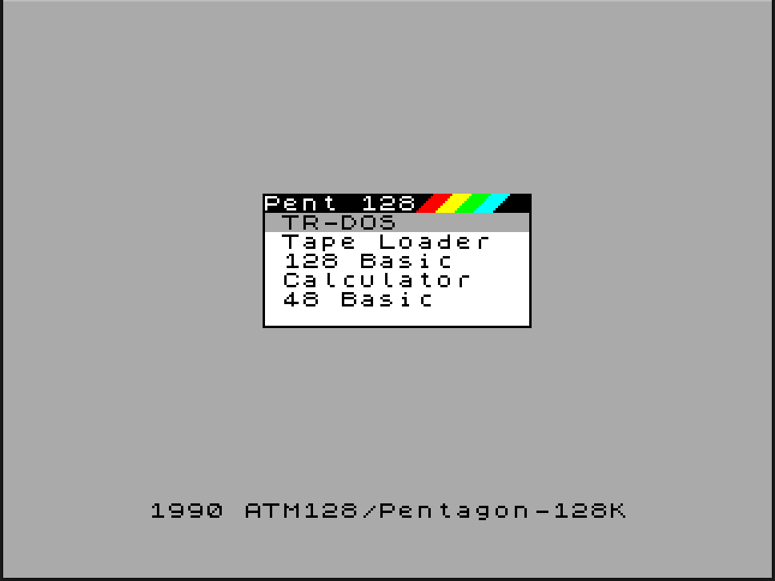

# Исправления прошивки ПЗУ для компьютера ATM128 известный как Пентагон-2 или Пентагон-128

Все скомпилированные файлы лежат в папке [build](build/)
- Для прошивки на реальный компьютер используется [amm_menu.rom](build/pentagon128.rom)
- Для эмулятора XPECCY используется [xpeccy.rom](build/xpeccy.rom)

## Меню 128

## TR-DOS 5.03

